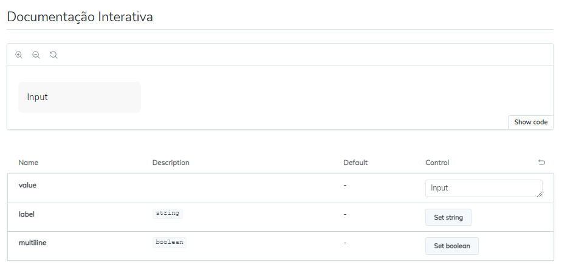

 ## Biblioteca de componentes Com Next.JS, Tailwind e Storybook
 

 Desenvolvimento de uma biblioteca de componentes poderosa com Next.js, Tailwind Css e Storybook. Usando o conceito de atomic Design e design Tokens, criando componentes de *link*, *input* e *button*

 ## Tools🛠
* Next.js
* Storybook
* Tailwind 

Para Baixar o projeto:

    git clone https://github.com/Kauan-Gomes/Design-System-Next.js-Tailwind.git

Para Rodar em sua máquina e verificar a documentação dos componentes:

    npm install
    npm run storybook

A biblioteca vai abrir na porta [localhost:6006](http://localhost:6006/)

## Imagens do Projeto

